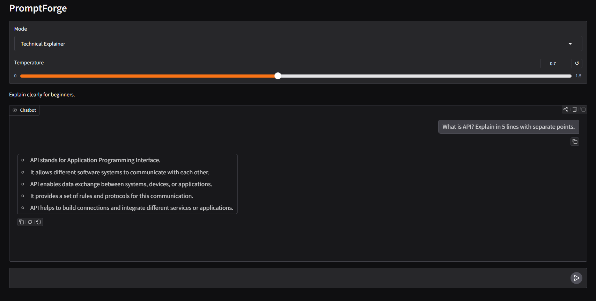
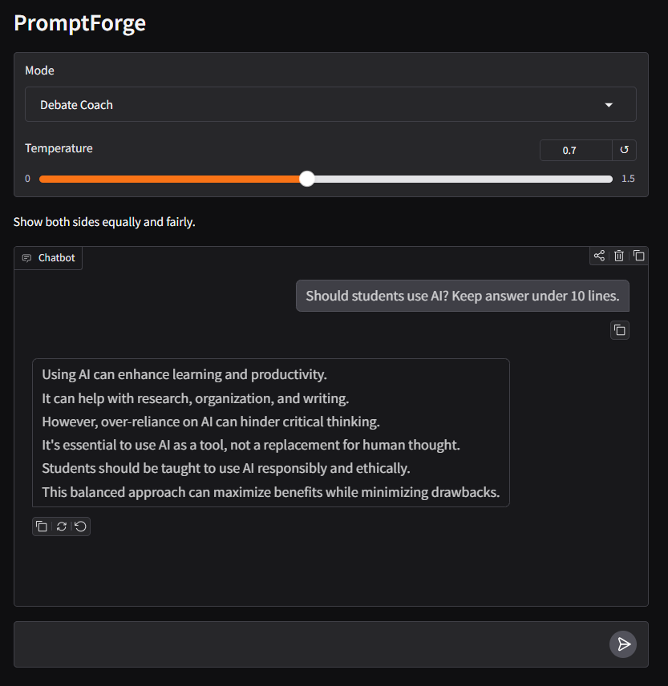
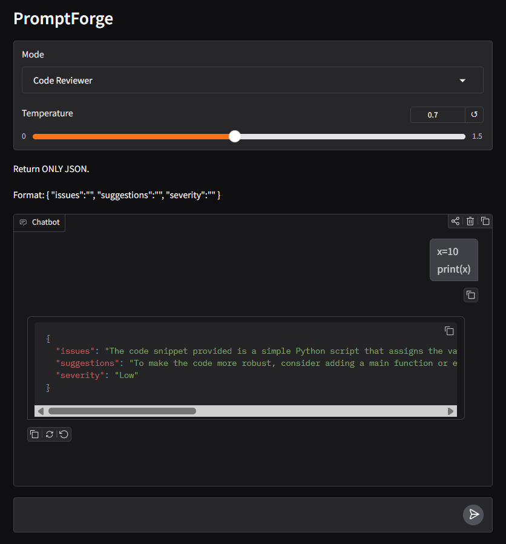
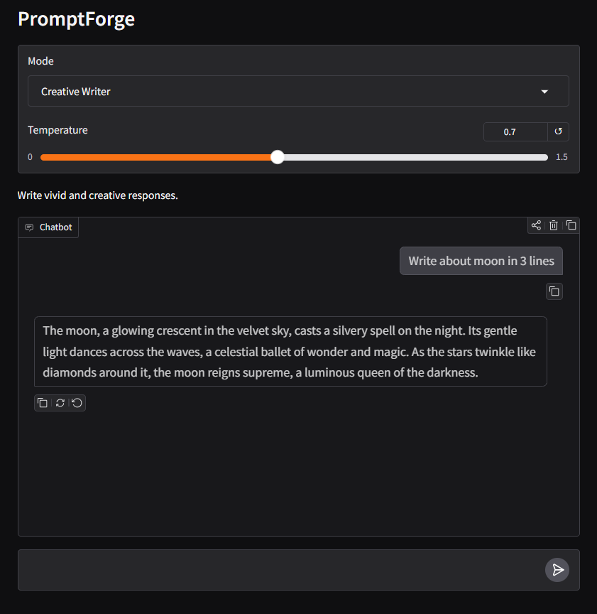

# PromptForge — Multi-Mode AI Assistant

A Gradio-powered AI assistant that supports multiple AI personas, streaming responses, and structured output using Groq API.

---

## Overview

PromptForge allows users to interact with AI in different modes.

Each mode changes the assistant's behavior through system prompts and output formatting.

### Features

* Technical Explainer
* Debate Coach
* Code Reviewer (JSON Output)
* Creative Writer
* Streaming Responses
* Temperature Control
* System Prompt Viewer

---

## Project Structure

week1-promptforge/

├── app.py
├── requirements.txt
├── .env.example
├── README.md
├── .gitignore
└── screenshots/

        ├── technical.png
        ├── debate.png
        ├── reviewer.png
        └── writer.png

---

## Installation

Clone repository:

```bash
git clone https://github.com/KomalVala97/genai-soc-2026.git
```

Open folder:

```bash
cd week1-promptforge
```

Create virtual environment:

```bash
python -m venv .venv
```

Activate (Windows):

```bash
.\.venv\Scripts\Activate.ps1
```

Install dependencies:

```bash
pip install -r requirements.txt
```

Create:

```text
.env
```

Add:

```env
GROQ_API_KEY=YOUR_API_KEY_HERE
```

Run application:

```bash
python app.py
```

---

## Screenshots

### Technical Explainer



---

### Debate Coach



---

### Code Reviewer



---

### Creative Writer



---

## Technologies Used

* Python
* Gradio
* Groq API
* python-dotenv

---

## Author

Komal Vala
